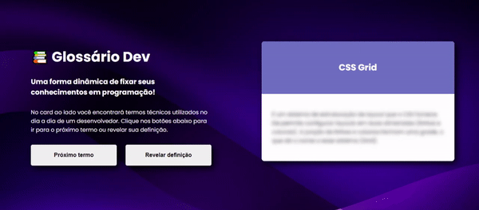

# Projeto Glossário Dev

Este projeto foi realizado durante a Semana da Programação QuickStaart.

## Tecnologias utilizadas

- HTML
- CSS
- JavaScript

## Desafios

A implantação do JavaScript é sempre um desafio pra mim, pois ainda sou iniciante. Porém foi muito enriquecedor ter contado com a linguagem!

## Coisas que aprendi

- Manipular elementos HTML através do JavaScript;
- Criar funções com JavaScript;
- Fazer um site responsivo para dispositivos de telas menores.
